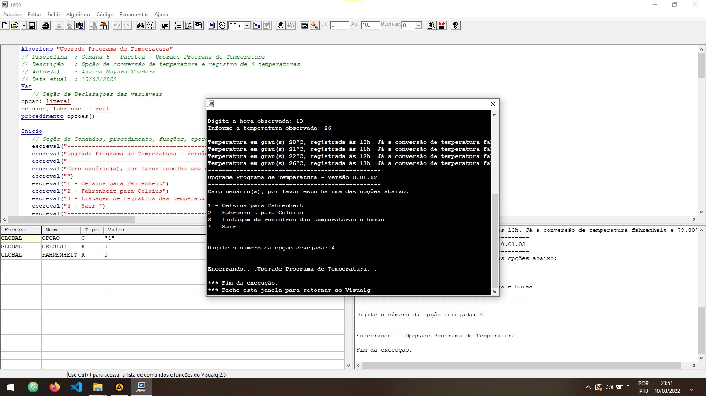

# Pacetech - Upgrade Programa de Temperatura - Semana 5 

 Curso de Introdução à lógica de programação 

#Criação de um algoritmo com os requisitos abaixo:#

1)Perguntar qual conversão deve ser realizada (Celsius para Fahrenheit ou Fahrenheit para Celsius)

2)O usuário possui 4 temperaturas que ele registrou ao longo do dia e gostaria de armazenar no programa para posterior consulta. Para isso deve-se:

(utilizar hora em que a temperatura foi medida)
(utilizar valor da temperatura em que a temperatura foi medida)

3)Após o usuário registrar as 4 temperaturas, imprimir o resultado. Importante, a impressão deve ser feita de forma ordenada (da menor temperatura para a maior temperatura digitada) (Método bolha).

### Eu sou, a Anaísa 😃 (Eterna aprendiz!)
- [Twitter](https://twitter.com/AnaisaMayara)
- [Github](https://github.com/anaisateodoro)
- [Email](anaisateodoro@gmail.com)

